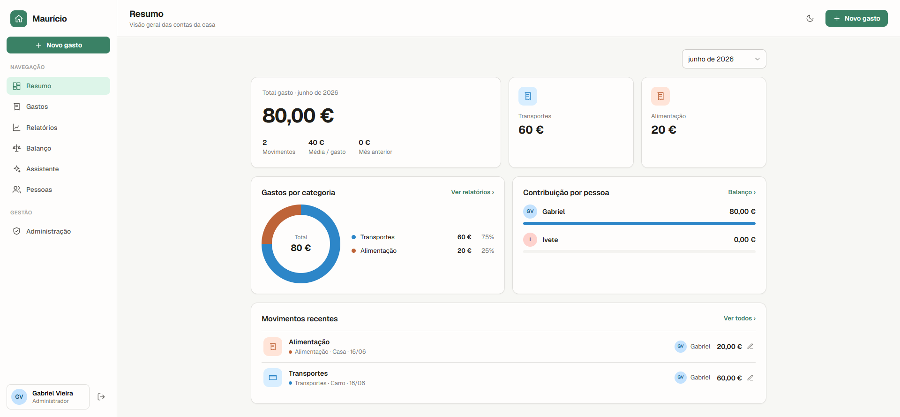

# Maurício — household accounts

A Nuxt 4 app for managing the shared expenses of a household (family/couple). Two
roles, **admin-only registration**, and a first-run setup screen on first use.

Multi-language (English, Portuguese, Spanish), light/dark theme, Euro.



## Stack

- **Nuxt 4** + Nitro, TypeScript
- **SQLite** (local file) via Drizzle ORM + better-sqlite3 — zero config
- **nuxt-auth-utils** — sealed-cookie session, scrypt password hashing
- **@nuxtjs/i18n** — locale detection with per-user preference + admin override
- **Ollama** — chat assistant with tool calling (optional)

## Getting started

```bash
npm install
cp .env.example .env        # set NUXT_SESSION_PASSWORD (min. 32 chars)
npm run dev                 # http://localhost:3000
```

The database (`server/db/lar.sqlite`) is created automatically on first boot.

## Authentication flow

1. **First use** (no users) → the app shows `/setup` to create the **first admin**.
   This is the only public registration, and only works while the database is empty.
2. With users and no session → `/login`.
3. New members are created **only by an admin** in *Administration*.

### Permissions

- **Admin**: edits anyone's expenses, manages members (create, change role, reset
  password, remove), categories, sessions, and the assistant.
- **Member**: sees everything but only edits their own expenses; no access to
  *Administration*.

### Sessions

Open sessions are tracked server-side (per device). Users can review and revoke their
own sessions; admins can review and block any session.

## Languages

Three locales: **English (en-US)**, **Portuguese (pt-PT)**, **Spanish (es-ES)**.
Resolution order: admin-forced locale > user preference > browser detection > English.
Numbers and dates follow the active locale.

## Categories

Categories and subcategories are editable by admins (create, edit, hide/show — hiding
is a reversible soft-delete). Each has a per-language name. When the assistant is
enabled, an admin can auto-fill the names of the other languages from a single one.

## Assistant (Ollama chat)

`/assistente` — a chat connected to Ollama that uses **tool calling** to read data,
propose writes, and generate charts. The model **never** mutates the database:
add/edit/delete go through a **confirmation card** in the chat → the click calls the
existing REST endpoint (with current permissions).

- **Read tools** (auto): `search_expenses`, `get_summary`, `get_balance`,
  `monthly_totals`, `list_members`, `get_categories`, `aggregate`.
- **Proposal tools** (show a card, never write): `propose_add_expense`,
  `propose_update_expense`, `propose_delete_expense`.
- **Charts**: `make_chart` (line/area/column/bar/stacked/donut/radar/table),
  rendered inline.

Conversation history is persisted (`chat_conversations`, `chat_messages`). Admins can
read and delete any member's conversations from *Administration*.

### Configuration

The assistant is configurable in *Administration* (enable/disable, server, model, and
— when "use cloud server" is on — a bearer token). Config is stored in the settings
table with `.env` fallback:

```bash
OLLAMA_BASE_URL=http://192.168.1.203:11434   # machine running Ollama
OLLAMA_MODEL=minimax-m3:cloud                # a model with tool support
OLLAMA_TOKEN=                                # only used when "use cloud server" is on
```

## Demo data (optional)

With an empty database:

```bash
curl -X POST http://localhost:3000/api/seed
```

Creates the "Casa Silva" family (Apr–Jun 2026). Everyone signs in with `demo1234`:

- `maria@casa.pt` — Admin
- `joao@casa.pt`, `rita@casa.pt` — Members

## Docker

Multi-stage image (Node 24, Nuxt build + native `better-sqlite3`). The SQLite database
lives in a volume (`lar_data` → `/app/data/lar.sqlite`), persistent across restarts.

```bash
cp .env.example .env         # set a strong, random NUXT_SESSION_PASSWORD (min. 32 chars)
docker compose up -d --build # http://localhost:3000
```

> Production boot **fails** if `NUXT_SESSION_PASSWORD` is left at the example value or
> is shorter than 32 chars (session-forgery protection).
> `OLLAMA_BASE_URL`/`OLLAMA_MODEL` are optional (have defaults).

First boot → empty DB → the app shows the admin registration form.

Build/run without compose:

```bash
docker build -t mauricio .
docker run -p 3000:3000 -e NUXT_SESSION_PASSWORD=<32+-secret> -v lar_data:/app/data mauricio
```

## Screens

Login · First-run setup · Summary · Expenses (list, filters, create/edit) · Reports ·
Balance · People · Administration · Profile.

## Structure

- `app/` — pages, layouts, components (`components/ui` primitives, `components/App`
  app-specific), composables, CSS
- `server/api` — auth, expenses, users, categories, chat, assistant endpoints
- `server/db` — Drizzle schema + SQLite connection
- `server/utils` — db migrations, categories, sessions, settings, Ollama, AI tools
- `i18n/locales` — `en.json`, `pt.json`, `es.json`
- `shared/config.ts` — Euro formatting, date helpers (client + server)
- `docs/superpowers/specs` — design spec
